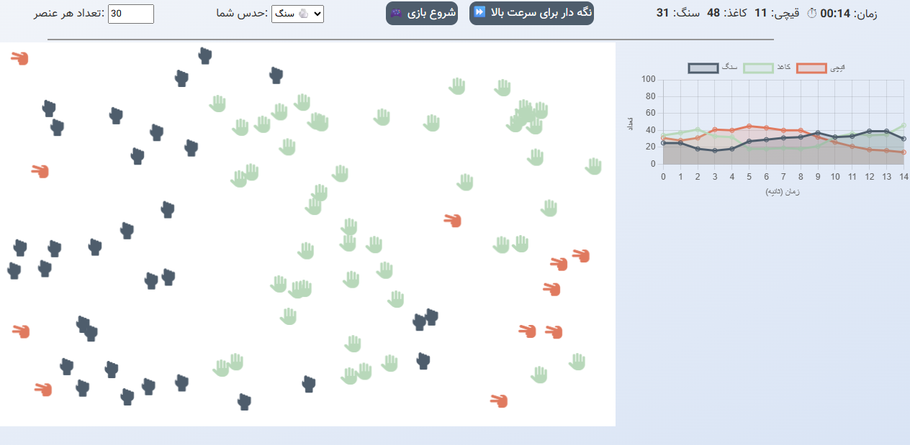

# 🎮 The Epic Rock-Paper-Scissors War: Digital Edition! 🪨📄✂️

Welcome to the battleground where rocks, papers, and scissors are throwing shade and battling it out to be the undisputed champion of the ring!  
This project is a fun simulator that feels like you tossed the good ol' rock-paper-scissors into a blender and hit turbo mode! 😎  
Just make a guess, sit back, and watch the chaos unfold.  
Fair warning though: this game is addictive!

---

## 🚀 What’s in the game?

- **Automated Element Battle**: Rocks, papers, and scissors fly around the screen like caffeinated ants, converting each other on contact!
- **Guess and Chill**: Predict the winner before the battle begins. If you guess right, treat yourself to some ice cream. 🍦
- **Custom Quantity**: Choose how many of each element enters the arena. (Don’t go overboard though — your CPU has feelings!)
- **Live Chart**: A slick graph tracking which element is dominating the battle. Stocks? Nah — Scissors!
- **Cool Timer**: Displays time in stylish mm:ss format — like the Element Olympics!
- **Sounds & Effects**: Ding-ding sounds for hits, and a glorious fireworks show at the end.
- **Turbo Mode**: Hold down the fast-forward button to bend time and space! ⏩
- **Reset & Replay**: Because who plays just once? 😜

---

## 📸 Sneak Peek

Here’s a sneak peek of the battle in progress:  

---

## ⚠️ Warning: May cause laughter and compulsive rematches!

This game is purely for fun.  
If you use it at parties to place bets — well, we don’t officially endorse it...  
but we support you emotionally — with tea and cookies. ☕🍪

And hey, if you win, toss a star our way. If you lose, toss two!  
We worked hard, okay? 🌟  
If you really had fun, come visit my GitHub and check out the other projects. I promise they’re just as quirky.

---

## 🛠️ How to Run

1. Clone or download the project:
   ```bash
   git clone https://github.com/changizyv/rock-paper-scissors-simulator.git
   ```
2. Run a local server (like XAMPP or WAMP), and place the project folder in `htdocs`.
3. Open your browser and go to: `localhost/rock-paper-scissors-simulator`
4. Choose the number of elements, make your guess, hit the Start button, and prepare for an epic showdown!

---

## 📂 What’s in the folder?

- `index.html`: The beating heart of the UI.
- `styles.css`: The stylish wardrobe (responsive & colorful).
- `app.js`: The brain behind all the motion, battles, timers, and turbo mode.
- `chart.js`: Manages the live chart like a stock exchange monitor — but way more dramatic.
- `fireworks.js`: Brings the grand finale with fireworks!
- `engine.php`: (Optional — for server-side stuff like score tracking if you feel fancy.)

---

## 🧑‍💻 Who made this?

**Hashem Changizi** — a developer who loves coding with a twist of humor!  
📍 [github.com/changizyv](https://github.com/changizyv)

---

## 💡 Got an idea? Hit me up!

Think this could use an online mode?  
An AI that predicts the winner?  
Maybe even Bitcoin betting? 😆  
Open an issue or send a pull request — we love creative chaos!

---

## 🙏 A little thanks

Thanks for checking out this project!  
If you enjoyed it, give it a ⭐ and share it with your friends.  
Let’s play rock-paper-scissors and take over the world — one element at a time! 😄
